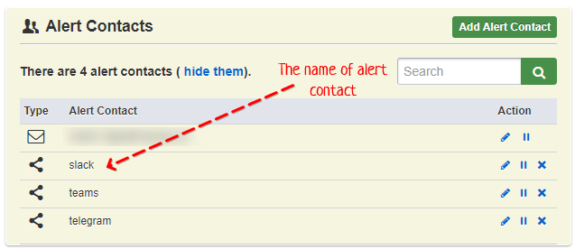

# uptimerobot-tool 
[/statusIcon)](https://1node.beta.teamcity.com/viewType.html?buildTypeId=UptimerobotTool_Build&guest=1)
[](https://sonarcloud.io/dashboard?id=1node-Solutions_uptimerobot-tool)


This tool is for automation website monitoring management. It uses [uptimerobot.com](https://uptimerobot.com) free accounts as primary service.
You will need json file with websites and their configurations (see example) and several uptimerobot.com accounts 
(one account per every 50 websites).  

## Preparation steps

Create several uptimerobot.com accounts (one account per every 50 websites you need to monitor) and get API token from each account.
Fill in `data/config.yml` file (see config.yml.example). After this, you will need to create all alert contacts that will receive 
alert message in critical situations (remember the names of created alert contacts).


Prepare json file. You can use google sheets and it scrips to transform human-readable table to json, or another software.
Json file must have next structure:
```json
[
  {
    "web-site-name": "",
    "config": {
      "keyword": "",
      "keyword_type": "",
      "contact": [""],
      "scheme": "",
      "port": 0
    }
  }
]
```

In the next table you can see all possible json fields and their values.  

| Field name    | Is required | Value  | Description                                                                                                                                                        |
|---------------|-------------|--------|--------------------------------------------------------------------------------------------------------------------------------------------------------------------|
| web-site-name | Yes         | string | URL that we will monitor. Without scheme. Example: store.1node.xyz/healthcheck                                                                                     |
| config        | No          | string | Configuration fields for created monitor. If configuration will not provided - monitor will be created with type http(s),  scheme http and without alert contacts. |
| keyword       | No          | string | If provided - monitor type "keyword" will be used. Keyword is case-sensitive.  Examples: "develoment" or "golang is awesome".                                      |
| keyword_type  | No          | string | Alert will be sent if provided keyword exists or not exists on website. Possible values: "exist", "not exist" (default).                                           |
| contact       | No          | string | An array of alert contact names, that you previously created in every account. For example (from screenshot): "slack", "telegram", "teams".                        |
| scheme        | No          | string | Available scheme for your website. For now can only be "http" or "https" (default).                                                                                |
| port          | No          | int    | Port on which your website available. Default 443.                                                                                                                 |

After preparation steps finished, put sitelist.json and config.yml to data/ folder in the root of the project.

## Docker

Pull image, prepare data directory and map it as volume in the container:
```shell script
docker pull 1node/uptimerobot-tool:latest
mkdir -p /full/path/to/project/data
cd /full/path/to/project/data
# prepare config files
docker run -it --rm $(pwd):/app/data 1node/uptimerobot-tool:latest
```

## Examples

### sitelist.json

```json
[
  {
    "web-site-name": "bitbucket.org/product/enterprise",
    "config": {
      "keyword": "Bitbucket",
      "keyword_type": "not exist",
      "contact": ["slack"]
    }
  },
  {
    "web-site-name": "kb.1node.xyz",
    "config": {
      "contact": ["slack", "teams", "telegram"]
    }
  },
  {
    "web-site-name": "exchange.1node.xyz/healthcheck",
    "config": {
      "keyword": "failed",
      "keyword_type": "exist",
      "contact": ["slack", "telegram"],
      "scheme": "http"
    }
  },
  {
    "web-site-name": "dash.1node.xyz",
    "config": {
      "contact": ["slack"],
      "scheme": "http"
    }
  }
]
```
### config.yml
```yaml
uptimerobot:
  - token: u1234567-7654321abcdef890g6f924e6
    email: user+1@gmail.com
  - token: u1234568-1234567fedvba0986e429fg
    email: user+2@gmail.com
```

## Scheduling tasks
If your sitelist.json changes frequently, it makes sense to run the program after every file change, or at least, by cron.
For example:
```
0 11 * * MON /full/path/to/project/uptimerobot-tool
```
Or in docker:
```
0 11 * * MON docker run -it --rm /full/path/to/project/data:/app/data 1node/uptimerobot-tool:latest
```
